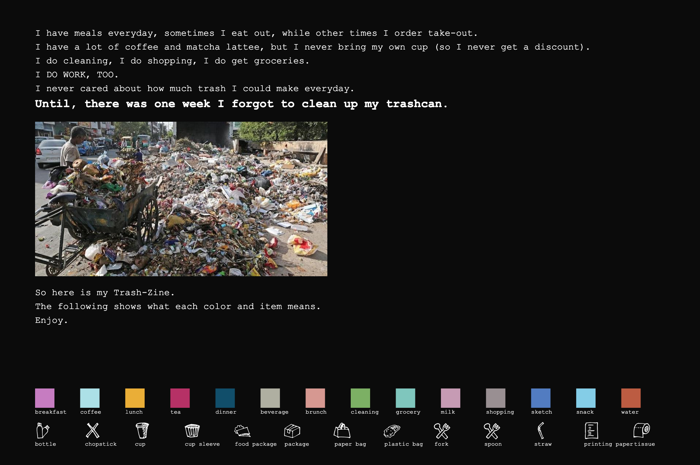

# Data-Zine Project

## Introduction
This is my Data-Zine Project. It is the visual representation of all kinds of trash (kitchen garbage excluded) I've made in the past three weeks (from September 10th to September 26th).

## Cover
The cover page is designed to be an introduction of the project background.
The bottom of the cover page is an instruction of the meaning of each color and icon.

## Middle Spread
The middle spread is designed to show the quantity of daily trash I make along the week.
The middle spread arranges the trash based on time. The trash are divided into seven days. In each day, they are categorized based on locations. In each location, they are arranged based on the time they are created.

## Back
The back is designed to show the total quantity of each item I made in the past three weeks.
The back arranges the trash based on item. For each item, the items with the same purpose are grouped together.

## Difficulties
### Embed images in my zine.
### Passing data between javascript files.
- I generate the color combinations when processing the data in my `middleScript.js` and save them into an object. To use the color combination in cover and back page design, passing the color combination object to other javascript files is an important process. To be honest, I still haven't figured that out. The current method I'm taking is to `console.log()` my color combination object and copy it into my other two javascript files. NOT COOL.
