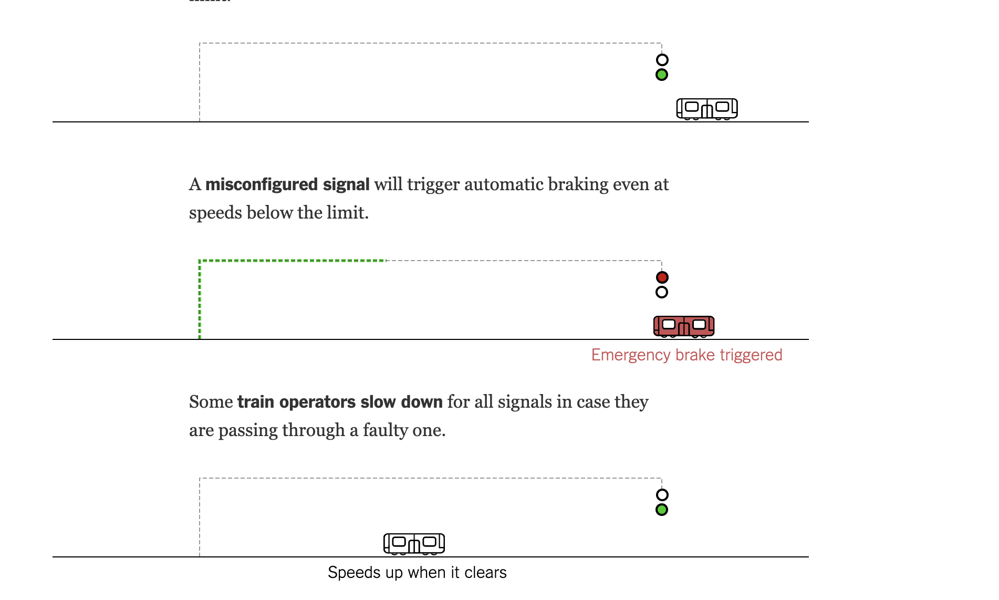
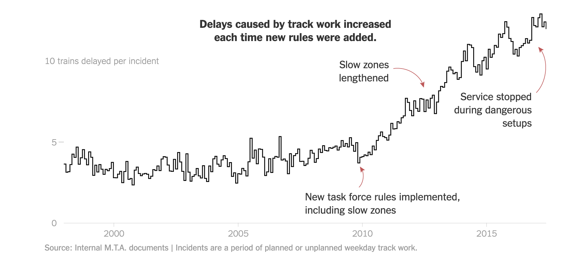
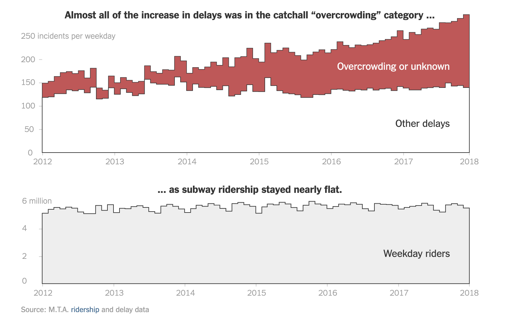
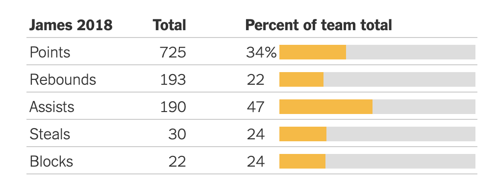
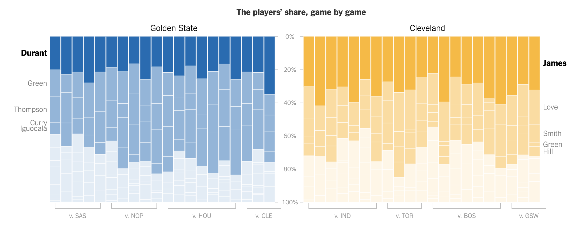
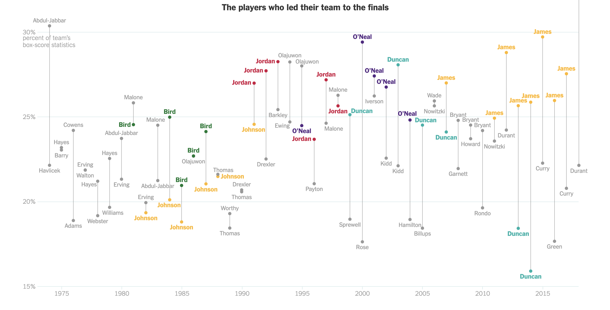

# Two articles that tell a story with data and data visualization

## How 2 M.T.A. Decisions Pushed the Subway Into Crisis
click [here](https://www.nytimes.com/interactive/2018/05/09/nyregion/subway-crisis-mta-decisions-signals-rules.html) to read the story.
The article talks about the two real reasons that cause the delay of NYC subway.
The first one is, the change of signal system and the related rules for the train operators.
The second one is, the new safety rules.
Not too many fancy data visualization is going on in this one. However, I do find how using data visualization properly can drastically improve the storytelling as well as make it much more fun to read.
The gifs compares the train speed before the signal system, ideally in the signal system, and in real life, to show how real-world scenario is much different from it was designed.

The diagrams shows how making new rules have slow down the train speed.

This comparison clearly shows that "overcrowding" has been incorrectly blamed!

Also, I was lucky that my trains weren't late many times. Thanks.

## LeBron James Is Carrying the Cavaliers in a Historic Way
click (here)[https://www.nytimes.com/interactive/2018/06/08/sports/basketball/lebron-nba-finals.html] to read the story.
The article talks about how Lebron James carried the whole Cavaliers during the NBA final. In fact, it shows how LBJ has carried his team in the NBA finals in his past nine consecutive NBA finals.
The article uses a lot of charts as evidence.
Some compared his contribution to the other teammates' and his oppoent, KD.

While the other compare his performance to the other great players in the NBA history.

This definitely shows how great LBJ is, but also, it hides some other aspects. Not a LBJ fan.
